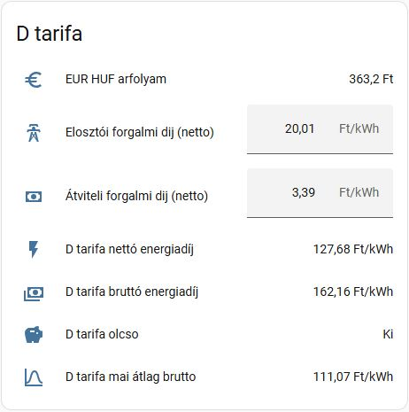

# MVM D (dinamikus) tarifa — Home Assistant egyedi integráció

Egyedi integráció, amely a magyar **MVM Next D (dinamikus) árszabás** aktuális
negyedórás árát számolja ki, és Home Assistant entitásokként teszi elérhetővé.
HACS-ből telepíthető, a felületen konfigurálható, és a HACS jelzi, ha új verzió
jelent meg.



---

## Mit csinál?

Negyedóránként lekéri a magyar zóna day-ahead tőzsdei villamosenergia-árát,
átváltja forintra, hozzáadja a hálózati díjakat és az áfát, majd ebből
entitásokat képez:

- mennyi **most** az áram ára Ft/kWh-ban (nettó és bruttó),
- mennyi a **mai átlag**, minimum és maximum, és mikor van a legolcsóbb, illetve
  a legdrágább negyedóra,
- **olcsó-e most** az áram az A1 sávhatár feletti fix árhoz képest — bináris
  szenzor, automatizáláshoz.

### Képlet

```
nettó [Ft/kWh] = HUPX_negyedóra [EUR/MWh] * EUR_HUF / 1000
                 + átviteli forgalmi díj + elosztói forgalmi díj

bruttó         = nettó * áfa szorzó (1.27)
```

### Adatforrások

| Adat | Forrás | Frissítés |
|---|---|---|
| Negyedórás day-ahead ár (HU zóna, EUR/MWh) | [api.energy-charts.info](https://api.energy-charts.info/price?bzn=HU) (Fraunhofer ISE) | 15 percenként |
| EUR/HUF árfolyam | [api.frankfurter.dev](https://api.frankfurter.dev/v1/latest?from=EUR&to=HUF) (EKB referencia-árfolyam) | óránként |

Egyik sem igényel kulcsot vagy regisztrációt.

Ugyanezt a forráspárost (energy-charts + EKB árfolyam) használja a holadelej.hu is,
így az értékek egymással összevethetők.

> **Licenc és forrásmegjelölés.** Az ár adat eredeti forrása a
> Bundesnetzagentur | SMARD.de, **CC BY 4.0** licenc alatt
> (<https://creativecommons.org/licenses/by/4.0/>), változtatás nélkül.
> Az integráció ezért eltárolja a válasz `license_info` mezőjét a HUPX árak
> szenzor attribútumai között — ezt **ne távolítsd el**.

---

## Követelmények

- **Home Assistant 2024.12 vagy újabb.**
- Kimenő internetkapcsolat a fenti két API felé.
- Telepítéshez [HACS](https://hacs.xyz) — vagy kézi másolás, lásd lent.

---

## Telepítés HACS-ből

### 1. lépés — a tároló hozzáadása egyedi tárolóként

HACS → jobb felső **⋮** menü → **Custom repositories**, majd:

| Mező | Érték |
|---|---|
| Repository | `https://github.com/frankyhun/HomeAssistant-MVM-D-tarifa` |
| Type | **Integration** |

**Add** — ezután az integráció megjelenik a HACS listájában.

### 2. lépés — telepítés és újraindítás

HACS → keresd meg az **MVM D (dinamikus) tarifa** elemet → **Download** →
Home Assistant **újraindítása**.

### 3. lépés — hozzáadás és a díjtételek megadása

**Beállítások → Eszközök és szolgáltatások → Integráció hozzáadása**, majd keresd
az **MVM D (dinamikus) tarifa** integrációt. Az űrlapon öt értéket kell megadni:

| Mező | Ajánlott kezdőérték |
|---|---|
| Átviteli forgalmi díj (nettó) | `3.39` Ft/kWh |
| Elosztói forgalmi díj (nettó) | `20.01` Ft/kWh |
| ÁFA szorzó | `1.27` |
| EUR/HUF (kézi tartalék) | `395` Ft |
| A1 sávhatár feletti bruttó ár | `70.1` Ft/kWh |
| Automatikus statisztika-pótlás | bekapcsolva |

A pontos díjtételek a saját MVM-számládon szerepelnek, érdemes onnan átvenni őket.
Az értékek utólag bármikor módosíthatók: vagy az integráció kártyáján a
**Beállítás** gombbal, vagy közvetlenül a létrejövő `number` entitásokon. Mindkettő
azonnal hat, újraindítás nélkül.

### Frissítés

A HACS a GitHub-kiadásokat figyeli: ha új verzió jelenik meg, a HACS
irányítópultján frissítésként látszik, és egy kattintással telepíthető. Frissítés
után indítsd újra a Home Assistantot.

### Kézi telepítés (HACS nélkül)

Másold a `custom_components/mvm_d_tarifa` mappát a Home Assistant konfigurációs
könyvtárába, hogy a `/config/custom_components/mvm_d_tarifa/manifest.json` út
létezzen, majd indítsd újra a Home Assistantot, és folytasd a 3. lépéssel. Ilyenkor
viszont az új verziókról nem kapsz értesítést.

---

## Létrehozott entitások

Minden entitás egyetlen **MVM D tarifa** eszköz alá kerül. Az entitás-azonosítókat
a Home Assistant a nyelvi beállításod szerinti névből képzi; magyar felületen:

### Ár-entitások

| Entitás | Leírás |
|---|---|
| `sensor.mvm_d_tarifa_netto_energiadij` | Az aktuális negyedóra **nettó** ára Ft/kWh. Attribútumok: `hupx_eur_mwh`, `arfolyam`, `negyedora_index`, `atviteli_forgalmi_dij`, `elosztoi_forgalmi_dij`, `szamitva` |
| `sensor.mvm_d_tarifa_brutto_energiadij` | Ugyanez **bruttó** (× áfa szorzó). Attribútum: `afa_szorzo` |
| `sensor.mvm_d_tarifa_mai_atlag_brutto` | A mai nap átlagos bruttó ára. Attribútumok: `minimum`, `maximum`, `legolcsobb_idopont`, `legdragabb_idopont`, `negyedorak_szama` |
| `binary_sensor.mvm_d_tarifa_olcso` | `on`, ha az aktuális bruttó ár az A1 referenciaár alatt van. Attribútumok: `kuszob`, `brutto_ar` |

### Díjtétel-entitások

A korábbi `input_number` helpereket ezek váltják ki. Automatizálásból is
állíthatók a `number.set_value` szolgáltatással, és a változás azonnal érvényes —
újraindítás és újratöltés nélkül.

| Entitás | Leírás |
|---|---|
| `number.mvm_d_tarifa_atviteli_forgalmi_dij` | Átviteli forgalmi díj (nettó), Ft/kWh |
| `number.mvm_d_tarifa_elosztoi_forgalmi_dij` | Elosztói forgalmi díj (nettó), Ft/kWh |
| `number.mvm_d_tarifa_afa_szorzo` | ÁFA szorzó |
| `number.mvm_d_tarifa_eur_huf_kezi_tartalek` | EUR/HUF kézi tartalék árfolyam |
| `number.mvm_d_tarifa_a1_referenciaar` | Az A1 sávhatár feletti fix bruttó ár |

Ugyanezek az értékek az integráció **Beállítás** gombjával is szerkeszthetők; a
két felület ugyanazt az adatot írja.

### Nyers adat

| Entitás | Leírás |
|---|---|
| `sensor.mvm_d_tarifa_hupx_arak` | A publikált negyedórák száma: `96` (csak a mai nap) vagy `192` (a másnapiakkal együtt). Attribútumok: `unix_seconds`, `price`, `unit`, `license_info`, `frissitve` |
| `sensor.mvm_d_tarifa_eur_huf_arfolyam` | Az EKB EUR/HUF árfolyam. Attribútumok: `hasznalt_arfolyam`, `forras` (`EKB` vagy `kezi`) |

A hosszú `unix_seconds` és `price` tömböt az integráció kihagyja a rögzítésből
(recorder), hogy ne hizlalja az adatbázist; a `license_info` viszont rögzül.

---

## A működés ellenőrzése

**Fejlesztői eszközök → Állapotok**, majd:

1. `sensor.mvm_d_tarifa_hupx_arak` állapota `96` vagy `192`.
2. Ugyanennek az `unit` attribútuma `EUR / MWh`.
3. `sensor.mvm_d_tarifa_eur_huf_arfolyam` egy nagyjából 350–420 közötti szám.
4. `sensor.mvm_d_tarifa_brutto_energiadij` értelmes Ft/kWh értéket mutat.

---

## Hibaelhárítás

### Az ár-entitások `Nem érhető el` állapotban vannak

1. **Elavult ár adat.** Ha az aktuális negyedóra kezdete 30 percnél régebbi —
   vagyis beragadt vagy leállt az adatlekérés —, az entitás inkább elérhetetlen
   lesz, mint hogy egy tegnapi árat mutasson aktuálisként. Ellenőrizd a HUPX árak
   szenzor `frissitve` és `unix_seconds` attribútumát.

2. **Publikálatlan negyedóra.** Ha az API `null` árat ad az aktuális negyedórára,
   az entitás elérhetetlen lesz — nem pedig 0 Ft/kWh.

3. **Nem érhető el az API.** Az integráció megtartja az utolsó sikeres választ, és
   percenként újrapróbálja. A részletek a naplóban:
   **Beállítások → Rendszer → Naplók**, keress a `mvm_d_tarifa` szóra.

4. **Az energy-charts 404-et ad a HU zónára.** Ez azt jelenti, hogy a kért
   időszakra nincs publikált ár — előfordul, amíg a mai nap adata meg nem
   jelenik. Az integráció ilyenkor a mai és a másnapi napra kifejezetten is
   rákérdez, és ha az sincs meg, inkább elérhetetlen marad. Ellenőrizhető
   böngészőből: <https://api.energy-charts.info/price?bzn=HU>.

### Csak a mai átlag nem érhető el

Akkor fordul elő, ha az ár-tömbben egyetlen mai (helyi idő szerinti) negyedóra
sincs. Jellemzően szintén beragadt adatlekérés áll mögötte.

### Rossz árat mutat

Nézd meg a nettó szenzor `arfolyam`, `atviteli_forgalmi_dij` és
`elosztoi_forgalmi_dij` attribútumát: ezek a ténylegesen használt értékek. A
díjtételek az integráció **Beállítás** gombjával javíthatók.

---

## Testreszabás

### MNB árfolyam használata EKB helyett

Az MVM az **MNB** napi hivatalos középárfolyamával számol, az integráció viszont az
**EKB** referencia-árfolyamot használja. Az eltérés tizedszázalékos nagyságrendű.
Az EUR/HUF mező kézi tartalék: csak akkor lép életbe, ha az árfolyam-API nem
elérhető, vagy érvénytelen értéket ad.

### Az „olcsó” küszöb hangolása

A bináris szenzor a `number.mvm_d_tarifa_a1_referenciaar` értékéhez hasonlítja az
aktuális bruttó árat. A küszöb menet közben, újraindítás nélkül állítható — akár
automatizálásból is —, és a szenzor azonnal újraszámol.

### Frissítési gyakoriság

Az árakat 15 percenként, az árfolyamot óránként kéri le az integráció; a számított
entitások percenként újraszámolnak, így a negyedóra váltása legfeljebb egy percet
késik. Hálózati kérés csak a gyorsítótár lejártakor indul.

---

## Átállás a korábbi YAML csomagról

A korábbi, `rest` és `template` alapú `packages/d_tarifa.yaml` csomag megszűnt; a
helyét ez az integráció vette át. Ha korábban azt használtad, a telepítés után:

1. **Töröld** a `/config/packages/d_tarifa.yaml` fájlt. A kettőt ne használd
   egyszerre: ugyanazokat az API-kat kérdezik le, és két, egymással
   összekeverhető entitáskészletet hoznak létre.
2. Ha a `packages` mappa üresen maradt, a `configuration.yaml`-ból a
   `packages: !include_dir_named packages` sor is elhagyható.
3. **Beállítások → Eszközök és szolgáltatások → Helperek** alatt töröld az öt
   megmaradt `input_number` helpert (`d_atviteli_forgalmi_dij`,
   `d_elosztoi_forgalmi_dij`, `d_afa_kulcs`, `d_arfolyam_kezi`,
   `d_a1_referencia`) — ezeket a `number` entitások váltják ki.
4. Az automatizálásokban és a kártyákon írd át a régi entitás-azonosítókat:

   | Régi | Új |
   |---|---|
   | `sensor.d_tarifa_netto_energiadij` | `sensor.mvm_d_tarifa_netto_energiadij` |
   | `sensor.d_tarifa_brutto_energiadij` | `sensor.mvm_d_tarifa_brutto_energiadij` |
   | `sensor.d_tarifa_mai_atlag_brutto` | `sensor.mvm_d_tarifa_mai_atlag_brutto` |
   | `binary_sensor.d_tarifa_olcso` | `binary_sensor.mvm_d_tarifa_olcso` |
   | `sensor.hupx_arak` | `sensor.mvm_d_tarifa_hupx_arak` |
   | `sensor.eur_huf_arfolyam` | `sensor.mvm_d_tarifa_eur_huf_arfolyam` |
   | `input_number.d_a1_referencia` | `number.mvm_d_tarifa_a1_referenciaar` |

   Ha a régi neveket szeretnéd megtartani, az új entitásokat át is nevezheted az
   entitás beállításainál — a régi YAML csomag törlése után az azonosítók
   felszabadulnak.

---

## A kiesés utólagos pótlása

Ha az adatforrásból hiányzott egy időszak, a szenzorok maguktól helyreállnak, de a
kiesés **lyukként marad a grafikonon**. Az integráció ezt vissza tudja tölteni: az
utólag publikált day-ahead adatból kiszámolja a hiányzó órák árát, és beírja a
hosszú távú statisztikákba. A `statistics-graph` kártyán és a hosszabb időtávra
zoomolt Előzményekben a lyuk így eltűnik.

> A nyers állapot-történetet (`states` tábla) a Home Assistant nem engedi
> visszamenőleg írni, ezért a rövid időtávú Előzmények nézetben a kiesés
> `Nem érhető el` marad. Csak az órás statisztika pótolható.

### Automatikusan

A **Automatikus statisztika-pótlás** kapcsoló alapból be van kapcsolva (a
telepítő űrlapon és a **Beállítás** gomb alatt is látszik). Ilyenkor az
integráció magától pótol, amikor kiesés után visszatér az adat, és hathatóránként
ellenőrzi, maradt-e lyuk — így a Home Assistant leállása alatt keletkezett hiány
is betöltődik.

### Kézzel

**Fejlesztői eszközök → Műveletek → MVM D (dinamikus) tarifa: Statisztika-pótlás**,
vagy automatizálásból:

```yaml
action: mvm_d_tarifa.backfill
data:
  start: "2026-09-08"   # opcionális, alapértelmezés: tegnap
  end: "2026-09-09"     # opcionális, alapértelmezés: ma
  overwrite: false      # opcionális, alapból csak a hiányzó órák
response_variable: potlas
```

A válasz megmondja, mi történt: `beirt_orak`, `kihagyott_orak`, `szamolt_orak`.

A pótlás **idempotens**: alapból csak azokra az órákra ír, amelyekre még nincs
statisztika — a Home Assistant saját, valós állapotokból számolt átlagát nem írja
felül. Nyugodtan futtatható ismételten. Az árfolyam napra pontos: minden negyedóra
a saját napjának EKB árfolyamával számol.

A pótláshoz a `recorder` integráció kell (alapból be van kapcsolva). Ha nincs, az
integráció ettől még működik, csak a szolgáltatás jelez hibát.

---

## Új verzió kiadása (karbantartóknak)

Tesztek futtatása a tároló gyökeréből:

```bash
pip install pytest-homeassistant-custom-component && pytest
```

A `tests/` a teljes folyamatot végigjátssza egy valódi Home Assistant
példányon: űrlap → bejegyzés → entitások → díjtétel-módosítás.

A HACS a GitHub-kiadásokból (release) veszi a verziót. Új verzió közreadása:

1. `custom_components/mvm_d_tarifa/manifest.json` → `version` mező emelése
   (pl. `1.0.1`),
2. commit és push a `main` ágra,
3. azonos nevű kiadás létrehozása:

```bash
gh release create v1.0.1 --title v1.0.1 --generate-notes
```

Ezután a HACS a következő ellenőrzésekor frissítést kínál a felhasználóknak. A
`Validate` munkafolyamat minden pusholásnál lefuttatja a hassfest és a HACS
ellenőrzést; a HACS ellenőrzéshez a GitHub-tárolónak leírással és legalább egy
témakörrel (topic) kell rendelkeznie.

---

## Licenc

MIT — lásd a [LICENSE](LICENSE) fájlt. Az ár adat forrása a
Bundesnetzagentur | SMARD.de, CC BY 4.0.
